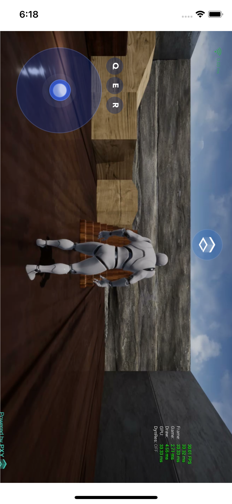

# LarkSR - ios wkwebview demo

本项目演示在 ios webview 中嵌入 LarkSR Web 客户端

[平行云](https://www.pingxingyun.com/)

[平行云-Lark开发者中心下载](https://www.pingxingyun.com/devCenter.html)

## 主要代码

### 要注意使用 WKWebView 而非 UIWebView

### WKWebView 关键配置项

```oc
//创建网页配置对象
WKWebViewConfiguration *config = [[WKWebViewConfiguration alloc] init];

// 必要设置，可以 lark 视频层和 ui 层能正确展示
config.allowsInlineMediaPlayback = YES;

// 必要设置，设置视频是否需要用户手动播放。不设置可能出现 5/5 视频不播放的问题
config.requiresUserActionForMediaPlayback = NO;
config.mediaTypesRequiringUserActionForPlayback = NO;
```

完整配置项请参考 Demo 中源码

### 忽略证书验证

LarkSR 支持 HTTPS 部署。在具体项目中如果使用了自签名的证书出现访问失败的问题，可参考下面代码忽略证书验证

设置 WKNavigationDelegate 代理

```oc
// 忽略证书验证
-(void)webView:(WKWebView *)webView didReceiveAuthenticationChallenge:(NSURLAuthenticationChallenge *)challenge completionHandler:(void (^)(NSURLSessionAuthChallengeDisposition disposition, NSURLCredential * _Nullable credential))completionHandler{
    
    if ([challenge.protectionSpace.authenticationMethod isEqualToString:NSURLAuthenticationMethodServerTrust]) {
        NSURLCredential *card = [[NSURLCredential alloc]initWithTrust:challenge.protectionSpace.serverTrust];
        completionHandler(NSURLSessionAuthChallengeUseCredential,card);
    }
}
```

### 效果

